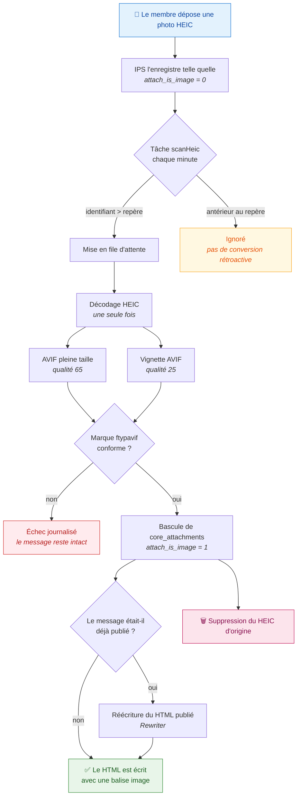

# HEIC Uploads

**Les photos d'iPhone ne s'affichent pas sur votre forum ? Cette application les convertit.**

[](CHANGELOG.md)
[](https://invisioncommunity.com/)
[](https://www.php.net/)
[](https://imagemagick.org/)
[](LICENSE)
[](#langues)
[](#%C3%A9tat-du-projet)
[](#contribuer)

---

## Le problème

Les iPhone récents photographient en **HEIC**. Invision Community ne sait pas
lire ce format : `\IPS\Image::create()` identifie les images par leurs octets
magiques et ne reconnaît ni HEIC ni HEIF.

Résultat côté membre : la photo est bien envoyée, mais elle apparaît dans le
message comme un **lien de téléchargement inutilisable** au lieu d'une image.
Sur un forum où l'on partage des photos, c'est un défaut qui se voit tous les
jours.

## La solution

HEIC Uploads convertit ces photos en **AVIF** — un format qu'Invision Community
sait afficher — sans jamais bloquer la publication du message.



> ⚠️ **L'original HEIC est supprimé après conversion.** C'est un choix assumé,
> pas un effet de bord : la photo pleine résolution est perdue. Sauvegardez
> votre répertoire d'envois avant d'installer.

## Pourquoi AVIF

| | HEIC | AVIF | WebP |
|---|---|---|---|
| Affiché par Invision Community | ❌ | ✅ | ✅ |
| Poids d'une photo de 12 Mpx | 2,1 Mo | **~90 Ko** | ~500 Ko |
| Temps d'encodage mesuré | — | **0,20 s** | 0,87 s |

Mesures sur un serveur à 4 cœurs, ImageMagick 7.1.1-43, photo iPhone 4032×3024.
L'AVIF s'est révélé à la fois **plus rapide à encoder et cinq fois plus léger**
que le WebP — le choix n'a pas été un arbitrage.

## Prérequis

- Invision Community **5.0** ou supérieur
- PHP **8.1** ou supérieur (pour `IMAGETYPE_AVIF`)
- Extension **imagick**, avec ImageMagick compilé avec :
  - le délégué **libheif** (décodage HEIC)
  - un délégué **AVIF** (libaom ou libavif)

L'application **refuse de s'installer** si l'un de ces points manque, et dit
précisément lequel et comment le corriger. Aucune installation silencieusement
inopérante.

Pour vérifier avant d'installer :

```bash
php -r 'var_dump( in_array("HEIC", Imagick::queryFormats()), in_array("AVIF", Imagick::queryFormats()) );'
```

## Installation

1. Copier le répertoire `heicuploads` dans `applications/` de votre forum.
2. Installer l'application depuis **AdminCP → Système → Applications**.
3. Autoriser l'extension `heic` dans les types de fichiers joints — sans quoi
   les membres ne pourront pas envoyer de HEIC du tout.
4. Vérifier le bloc d'état sur **AdminCP → Communauté → HEIC Uploads**.

## Mise à jour

**Copier les nouveaux fichiers ne suffit pas.** Les manifestes `data/*.json` et
`data/lang.xml` ne sont relus qu'à l'installation ou à une montée de version.
Sans réconciliation, une version apportant un réglage ou un libellé nouveau
s'installe dans un état trompeur :

- le réglage n'existe pas en base, et `Settings::changeValues()` **l'ignore
  silencieusement** — la page de réglages paraît fonctionner et n'enregistre
  rien ;
- le libellé n'existe pas, et l'AdminCP affiche la clé brute ;
- une colonne manquante bloque toute la chaîne, visible seulement dans les
  journaux.

D'où la marche à suivre :

```bash
# 1. Copier les fichiers dans applications/heicuploads/

# 2. Voir ce qui manque en base — ne modifie rien
php applications/heicuploads/tools/deploy-sync.php

# 3. Appliquer
php applications/heicuploads/tools/deploy-sync.php --ecrire

# 4. Réappliquer la traduction, maintenant que les libellés existent
php applications/heicuploads/tools/import-lang.php french <id> --ecrire

# 5. Contrôler la chaîne de bout en bout
php applications/heicuploads/tools/diagnose.php
```

`deploy-sync.php` n'écrit rien de sa main : il appelle les routines du cœur
(`installDatabaseSchema`, `installJsonData`, `installLanguages`), qui sont
additives et rejouables. Il ne touche à aucune pièce jointe.

## Réglages

| Réglage | Défaut | Effet |
|---|---|---|
| Activation | activé | Coupe la conversion **et** la file d'attente |
| Qualité AVIF | 65 | ~90 Ko pour une photo de 12 Mpx |
| Qualité vignette | 25 | La vignette est petite, une valeur basse suffit |
| Filtre | catrom | Équilibré ; lanczos plus piqué, triangle plus doux |
| Vitesse d'encodage | 9 | Même poids que 6, sept fois plus rapide |
| Threads | 2 | Au-delà, gain nul et coût processeur doublé |

Les **dimensions maximales** viennent des réglages natifs d'Invision Community
(`attachment_resample_size` et `attachment_image_size`). Il n'y a délibérément
pas de réglage concurrent : deux valeurs pour la même chose finissent toujours
par diverger.

## Outillage

Six scripts, à lancer depuis la racine du forum. Tous refusent de s'exécuter
par HTTP.

```bash
php applications/heicuploads/tools/selftest.php photo.heic   # le moteur seul, hors IPS
php applications/heicuploads/tools/diagnose.php              # où la chaîne casse
php applications/heicuploads/tools/verify.php                # les conversions sont-elles saines
php applications/heicuploads/tools/deploy-sync.php           # aligner la base sur le manifeste
php applications/heicuploads/tools/import-lang.php           # appliquer une traduction
php applications/heicuploads/tools/repair-fullimage.php      # réparer d'anciennes réécritures
```

Ceux qui modifient quelque chose — `deploy-sync`, `import-lang`,
`repair-fullimage` — sont en **simulation par défaut** et n'écrivent qu'avec
`--ecrire`.

`selftest.php` mérite un mot : le moteur de conversion ne dépend d'**aucune**
classe `\IPS`. On peut donc rejouer un fichier litigieux en ligne de commande,
sans forum, sans base de données.

## Langues

Anglais _(par défaut)_, français, espagnol, chinois simplifié, hindi.

`data/lang.xml` n'est lu qu'à l'installation. Pour appliquer une traduction
ensuite :

```bash
php applications/heicuploads/tools/import-lang.php           # liste les langues
php applications/heicuploads/tools/import-lang.php french 2 --ecrire
```

## État du projet

**Stable.** L'application tourne en production sur un forum réel depuis le
10 août 2026 : **191 conversions, aucune en échec**, chaîne validée de l'envoi
à l'affichage — y compris la réécriture des messages publiés avant la fin de la
conversion.

Une limite connue, à laquelle personne ne s'est encore heurté : si le processus
de conversion est tué en cours de route (dépassement mémoire, par exemple), la
tentative est comptabilisée mais l'échec n'est jamais consigné. La ligne reste
« en attente », n'est plus rejouée une fois le plafond de tentatives atteint, et
le bloc d'état continue de l'annoncer comme normale. Correction prévue.

Voir le [CHANGELOG](CHANGELOG.md) pour l'historique, y compris les incidents et
ce qu'ils ont appris.

## Contribuer

Les remontées sont bienvenues, surtout accompagnées de la sortie de
`tools/diagnose.php` — elle situe le problème en six étapes.

Le code porte ses raisons en commentaire. Chaque contournement du cœur
d'Invision Community cite le fichier et la ligne qui le justifient — pourquoi le
HTML d'un message est figé à la publication, pourquoi `autoOrient()` doit
précéder `stripImage()`, pourquoi les jetons de stockage sont restitués en
sortie et non en entrée. Les lire avant de modifier évite de refaire des
découvertes coûteuses.

## Licence

MIT — voir [LICENSE](LICENSE).

## Auteur

**Paul ARGOUD** — [paul.argoud.net](https://paul.argoud.net)
