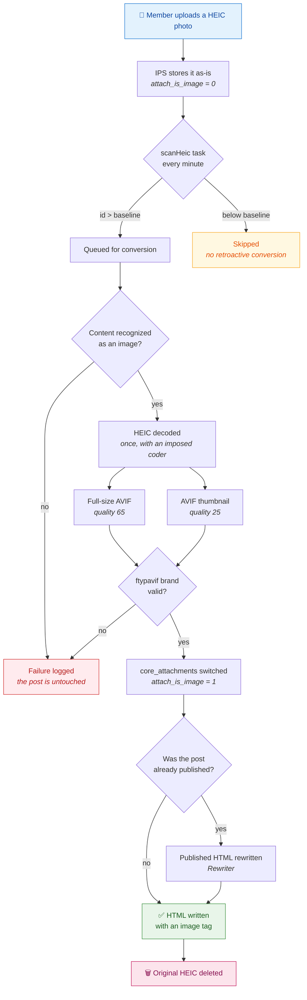

# HEIC Uploads

**iPhone photos won't display on your forum? This application converts them.**

[](CHANGELOG.md)
[](https://invisioncommunity.com/)
[](https://www.php.net/)
[](https://imagemagick.org/)
[](LICENSE)
[](#languages)
[](#project-status)
[](#contributing)

---

## The problem

Recent iPhones shoot in **HEIC**. Invision Community cannot read that format:
`\IPS\Image::create()` identifies images by their magic bytes, and recognizes
neither HEIC nor HEIF.

What the member sees: the photo uploads fine, but it shows up in the post as an
**unusable download link** instead of an image. On a forum where people share
photos, that is a defect you run into every day.

## The solution

HEIC Uploads converts those photos to **AVIF** — a format Invision Community
does display — without ever blocking the post from going through.



> ⚠️ **The original HEIC is deleted after conversion.** This is a deliberate
> choice, not a side effect: the full-resolution photo is gone. Back up your
> uploads directory before installing.

## Why AVIF

| | HEIC | AVIF | WebP |
|---|---|---|---|
| Displayed by Invision Community | ❌ | ✅ | ✅ |
| Size of a 12 MP photo | 2.1 MB | **~90 KB** | ~500 KB |
| Measured encoding time | — | **0.20 s** | 0.87 s |

Measured on a 4-core server, ImageMagick 7.1.1-43, iPhone photo at 4032×3024.
AVIF turned out to be both **faster to encode and five times lighter** than
WebP — the choice was not a trade-off.

## Requirements

- Invision Community **5.0** or later
- PHP **8.1** or later (for `IMAGETYPE_AVIF`)
- The **imagick** extension, with ImageMagick compiled with:
  - the **libheif** delegate (HEIC decoding)
  - an **AVIF** delegate (libaom or libavif)

The application **refuses to install** if any of these is missing, and tells you
exactly which one and how to fix it. No silently inoperative install.

To check before installing:

```bash
php -r 'var_dump( in_array("HEIC", Imagick::queryFormats()), in_array("AVIF", Imagick::queryFormats()) );'
```

## Installation

1. Copy the `heicuploads` directory into your forum's `applications/`.
2. Install the application from **AdminCP → System → Applications**.
3. Allow the `heic` extension in your attachment file types — otherwise members
   cannot upload HEIC at all.
4. Check the status block under **AdminCP → Community → HEIC Uploads**.

## Updating

**Copying the new files is not enough.** The `data/*.json` manifests and
`data/lang.xml` are only read at install time or on a version upgrade. Without
reconciliation, a version that adds a setting or a label installs into a
misleading state:

- the setting does not exist in the database, and `Settings::changeValues()`
  **silently ignores it** — the settings page appears to work and saves nothing;
- the label does not exist, and the AdminCP shows the raw key;
- a missing column breaks the whole chain, visible only in the logs.

Hence the procedure:

```bash
# 1. Copy the files into applications/heicuploads/

# 2. See what is missing in the database — changes nothing
php applications/heicuploads/tools/deploy-sync.php

# 3. Apply
php applications/heicuploads/tools/deploy-sync.php --write

# 4. Re-apply the translation, now that the labels exist
php applications/heicuploads/tools/import-lang.php french <id> --write

# 5. Check the chain end to end
php applications/heicuploads/tools/diagnose.php
```

`deploy-sync.php` writes nothing of its own: it calls the core's own routines
(`installDatabaseSchema`, `installJsonData`, `installLanguages`), which are
additive and repeatable. It never touches an attachment.

One caveat worth knowing: `installTasks()` issues a `REPLACE INTO` on four
columns of `core_tasks`, so `enabled`, `last_run`, `lock_count` and `running`
revert to their schema defaults. A task that reports "never run" right after a
sync has not failed — its history was reset.

## Settings

| Setting | Default | Effect |
|---|---|---|
| Enabled | on | Stops conversion **and** the queue |
| AVIF quality | 65 | ~90 KB for a 12 MP photo |
| Thumbnail quality | 25 | Thumbnails are small, a low value is enough |
| Resizing filter | catrom | Balanced; lanczos sharper, triangle softer |
| Encoding speed | 9 | Same file size as 6, seven times faster |
| Threads | 2 | Beyond this, no gain and double the CPU cost |

**Maximum dimensions** come from Invision Community's own settings
(`attachment_resample_size` and `attachment_image_size`). There is deliberately
no competing setting: two values for the same thing always end up diverging.

Above the form, the status block reports whether the server can convert, the
**starting point** below which nothing is ever converted, the conversion
counters, and a **Retry blocked conversions** button whenever there are any.

## Tooling

Six scripts, run from the forum root. All of them refuse to run over HTTP.

```bash
php applications/heicuploads/tools/selftest.php photo.heic   # the engine alone, without IPS
php applications/heicuploads/tools/diagnose.php              # where the chain breaks
php applications/heicuploads/tools/verify.php                # are the conversions sound
php applications/heicuploads/tools/deploy-sync.php           # align the database with the manifests
php applications/heicuploads/tools/import-lang.php           # apply a translation
php applications/heicuploads/tools/repair-fullimage.php      # repair older rewrites
```

The ones that change anything — `deploy-sync`, `import-lang`,
`repair-fullimage` — **simulate by default** and only write with `--write`
(`--ecrire`, the original French flag, still works).

`selftest.php` deserves a mention: the conversion engine depends on **no**
`\IPS` class. You can replay a problematic file from the command line, with no
forum and no database. It is also the cheapest way to prove a new release on a
given ImageMagick build before touching the forum.

## Building a release

Invision Community only accepts an **uncompressed `.tar`** whose root holds the
*contents* of the application directory. The archives GitHub generates on its
own are unusable: they are compressed and wrapped in a versioned root folder.

```bash
./build-release.sh v1.0.1
```

The script builds the archive from the git tag — reproducible, and files that
git does not track cannot slip in — then checks its structure and refuses to
produce a non-compliant archive. Attach the result to the GitHub release.

Note that uploading such an archive over an **already installed** application
goes through the core's upgrade path, which looks for a `setup/` directory this
application does not have. That path has never been exercised here. To update an
existing install, copy the files and run `deploy-sync.php`.

## Languages

English _(default)_, French, Spanish, Simplified Chinese, Hindi.

`data/lang.xml` is only read at install time. To apply a translation afterwards:

```bash
php applications/heicuploads/tools/import-lang.php           # lists the languages
php applications/heicuploads/tools/import-lang.php french 2 --write
```

## Project status

**Stable.** The application has been running in production on a real forum since
10 August 2026: **191 conversions, none failed**, chain validated from upload to
display — including rewriting posts published before the conversion finished.

**1.0.1** is an audit release, deployed on 14 August 2026. It fixes the two
known limitations of 1.0.0 and two bugs that were live in production: the
settings page died with a fatal error on save, and the queue's deduplication
key never matched. It also closes two security gaps — member-supplied content
was handed to ImageMagick without ever checking it was an image, and a starting
point that had never been set was indistinguishable from zero, a value that
authorizes retroactive conversion of the entire attachment history. An
interrupted conversion is now closed, counted and **retryable from the AdminCP**.

See the [CHANGELOG](CHANGELOG.md) for the details, the evidence, and the history
of incidents with what they taught.

## Contributing

Reports are welcome, especially with the output of `tools/diagnose.php` — it
locates the problem in six steps.

The code carries its reasons in comments. Every workaround for the Invision
Community core cites the file and line that justify it: why a post's HTML is
frozen at publication, why `autoOrient()` must precede `stripImage()`, why
storage tokens are restored on output rather than on input. Reading them before
making changes saves repeating expensive discoveries.

## License

MIT — see [LICENSE](LICENSE).

## Author

**Paul ARGOUD** — [paul.argoud.net](https://paul.argoud.net)
